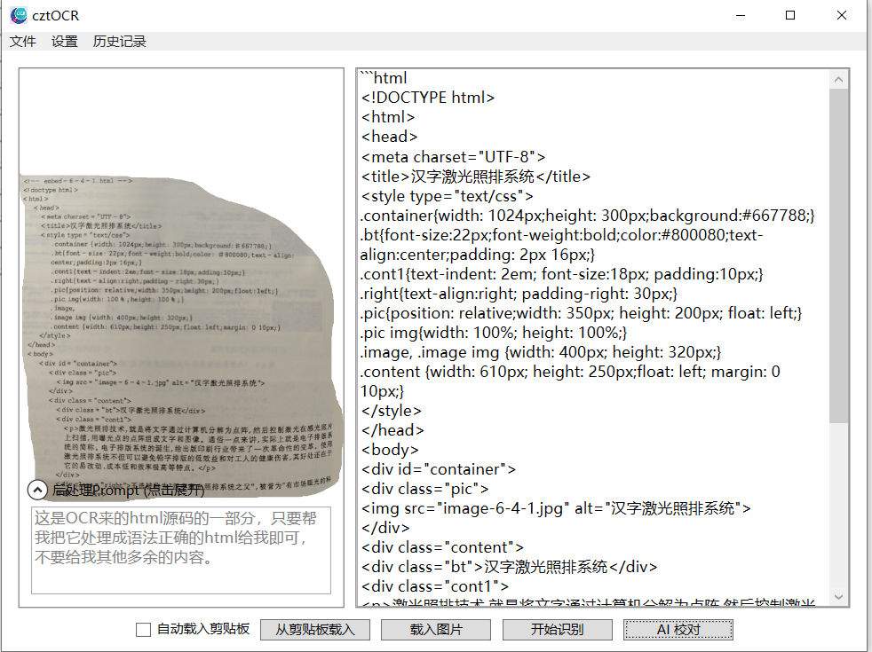

**项目名称：** cztOCR

---

## 简介
启发于天若OCR开发出的 cztOCR,这是一款基于 WPF 的超轻量桌面工具，可自动监控剪贴板或手动加载图片，调用百度 OCR API 识别文字，支持自定义prompt通过 DeepSeek AI 校对识别结果。

---

## 主要功能

* **剪贴板侦测**
  自动监测系统剪贴板中的图片，一旦检测到新图片即自动加载并识别。

* **手动加载**
  支持从文件系统手动打开图片（`.jpg`、`.png`、`.bmp` 等格式）。

* **百度 OCR 识别**
  调用百度通用文字识别（基础 / 高精度）API，支持多种语言的OCR。

* **DeepSeek AI 校对**
  利用 DeepSeek 智能校对识别结果,支持自定义prompt,自动纠正 OCR 误识别。

---

## 快速开始

1. **下载项目**

   在releases中下载zip文件,解压即用.

2. **配置 API Key**
   * 自行查阅如何申请百度OCR API(每月1000次免费的OCR调用,百度的效果算是国内最好的)
   * 自行查阅配置deepseek的api(deepseek价格是最低廉的)
   * 启动软件 → 菜单 “设置” → 填入 百度 Key/Secret 与 DeepSeek Key → 保存。

3. **使用**
   * **自动识别**：win+shift+s截图想要的区域至剪贴板，软件自动触发识别。
   * **手动识别**：点击 “打开图片” 按钮，加载本地图片，点击 “开始识别”。
   * **AI 校对**：点击 “AI 校对” 按钮，自动优化识别文本。
   * **裁剪区域**：在图片上两次点击框选保留区域，软件自动裁剪。

---
## 示例使用

* Show非重后自动OCR
* 绑定prompt到记录
* 记录是否监控剪贴板。

---

## 许可证
本项目采用 [MIT License](LICENSE) 开源，欢迎 Fork、Issue 和 PR。

## 其他
如果这个项目帮到你,能给个⭐的话我会感激不尽||ヽ(*￣▽￣*)ノミ|Ю  
虽然是WPF写的,但是主要是自用而且写的比较急,所以界面看起来有点原始,如果后续反响好的话就把UI写的好看点(吐舌)
